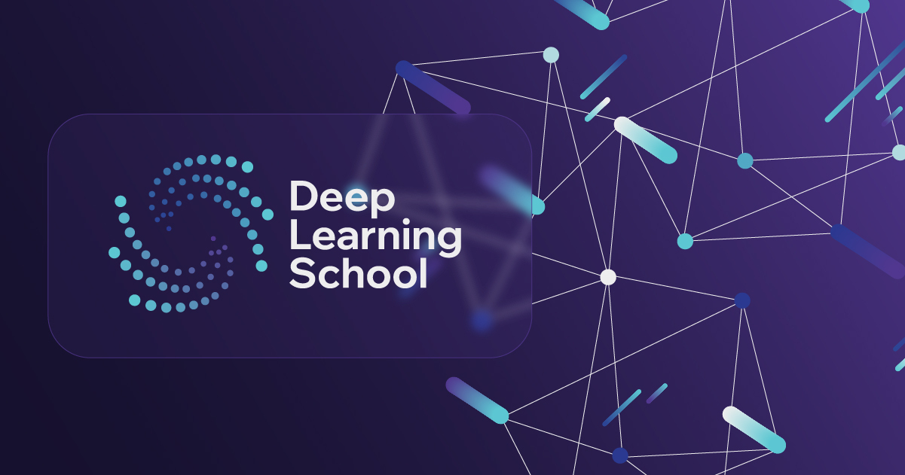

# Speech

  

Материалы Speech курса Deep Learning School (DLS)\

Этот курс посвящен современным методам обработки звука и речи (Speech Processing) с использованием машинного обучения. 

Студенты познакомятся с основными способами представления аудиосигналов (wav, spectrograms, continuous embeddings, discrete tokens) , фундаментальными задачами обработки речи, такими как автоматическое распознавание речи (ASR) и синтез речи (TTS), а также получат обзор других ключевых направлений. Также курс включает в себя знакомство с задачей построения моделей для малоресурсных и не английских языков, и в эру больших языковых моделей, часть курса будет посвящена Speech LLM и мультимодальным LLM, включающим речь. Завершающие недели будут посвящены задачам в аудиодомене.

- [**Наш сайт**](https://dls.samcs.ru/)

- [**Наш телеграм канал**](t.me/deep_learning_school_news)

## Основные материалы

1. [Введение в аудио](./week_01_speech_intro_to_audio/README.md)

2. [Способы представления аудио](./week_02_speech_representations/README.md)

3. [SSL](./week_03_speech_ssl/README.md)

